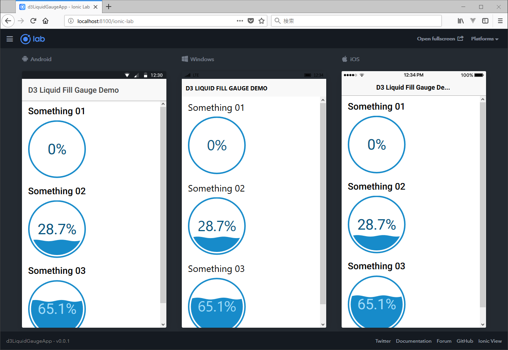

# D3 Liquid Fill Gauge Demo on the Ionic app

A simple ionic app of the [ngx-d3-liquid-fill-gauge](https://github.com/adedayo/ngx-d3-liquid-fill-gauge).



## How to run

### Prerequisites

Please install the ionic Ver. 3.2.X or later and the cordova.

```sh
$ npm install -g ionic@latest
$ npm install -g cordova
```

### Clone and serve

```sh
$ git clone https://github.com/kemokemo/d3LiquidGaugeApp
$ cd d3LiquidGaugeApp
$ ionic serve
```

## Dependencies

* [ngx-d3-liquid-fill-gauge](https://github.com/adedayo/ngx-d3-liquid-fill-gauge)
* [D3](https://github.com/d3/d3)

## License

[BSD 3-Clause](https://opensource.org/licenses/BSD-3-Clause)